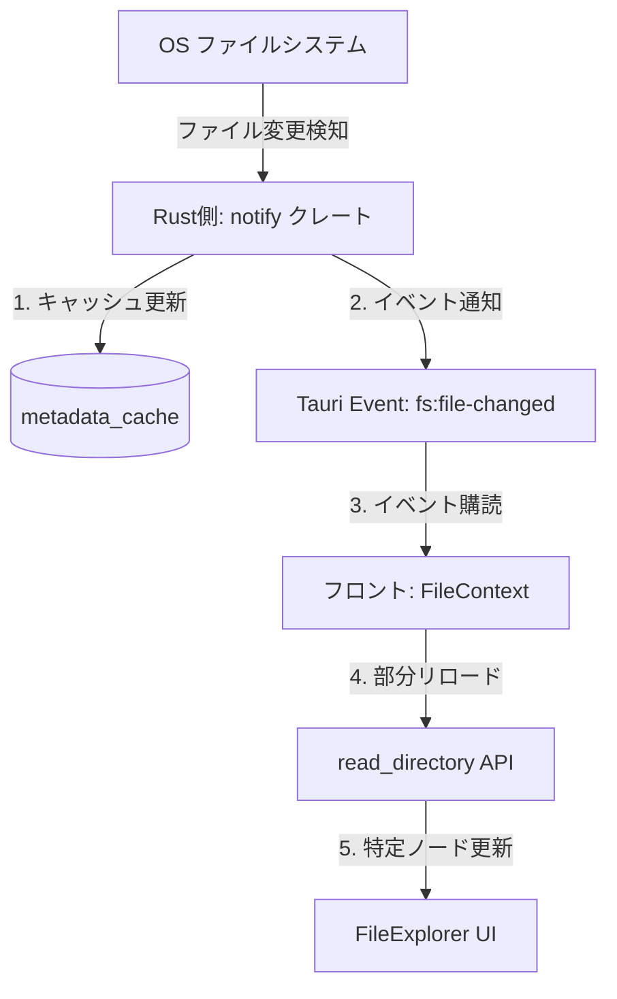

# FileExplorer 仕様

## 1. 概要
`FileExplorer` は、小説執筆用エディター（`novelaid-editor` / `novelaid-editor-next`）において、プロジェクト内のファイルやフォルダをツリー形式で一覧表示し、ドキュメントの開閉、新規作成、名前変更、削除、ドラッグ＆ドロップによる移動・コピーなどのファイル操作を提供するUIコンポーネントです。

---

## 2. 状態管理（ステート）の設計

### 2.1. 新旧エディタの実装と課題
* **現行（`novelaid-editor` / Electron版）**:
  各フォルダコンポーネント（`FileTreeItem`）が子要素の配列を個別に保持する「分散ツリーステート」を採用。部分的なリロードには強いものの、ツリー全体を横断する操作（例：現在開いているファイルをエクスプローラー上で強調表示し、そこまでフォルダを自動展開してスクロールする Reveal 処理など）が複雑化していました。
* **次世代（`novelaid-editor-next` / Tauri版・現状）**:
  `FileExplorer` コンポーネントに `files: FileNode[]` を1つのツリーとして一括して保持。ファイル操作を行うたびにルートディレクトリ全体から再ロードしているため、フォルダの開閉状態（展開状態）の維持が困難で、エクスプローラー外のコンポーネントとの連携も不足しています。

### 2.2. 再検討後の設計（グローバル `FileContext` への移行）
エクスプローラー部とエディタタブなどの他コンポーネントが密に連携し、部分的な更新や表示の同期をスムーズに行うため、ファイル状態をグローバルな React Context（`FileContext`）に引き上げます。

* **提供する状態（State）**:
  * `projectFiles: FileNode[]`
    プロジェクトのルート配下のファイルツリー構造。
  * `expandedPaths: Set<string>`
    現在展開（オープン）されているフォルダの絶対パス一覧。
  * `selectedPath: string | null`
    現在エクスプローラー上でフォーカスされているアイテムの絶対パス。
* **提供する操作（API）**:
  * `toggleFolder(path: string)`
    指定フォルダの展開・折りたたみを切り替える。
  * `revealPath(path: string)`
    指定したファイルまでのパスに含まれるすべての親フォルダを自動的に展開し、そのファイルを選択・スクロール表示する。
  * `refreshDirectory(path: string)`
    指定したディレクトリ配下のみを部分的にリロードし、ツリーの該当ノードのみを更新する。

---

## 3. ファイル監視（Watcher）とリアルタイム更新

外部ツール（Git操作、外部エディタなど）によるファイルシステムの変更をリアルタイムに検知し、エディタ内の表示に即座に同期させる監視機構を設計します。

### 3.1. 監視システム構成

### 3.2. バックエンド（Rustプラグイン `tauri-plugin-novelaid-fs`）の処理
1. `set_project_directory` によってプロジェクトフォルダが選択された際、バックグラウンドスレッドで `notify` クレートを用いた監視を開始する。
2. 以下のファイルシステムイベントを処理：
   * **作成 (`Create`) / 削除 (`Remove`) / 名前変更・移動 (`Rename`)**:
     対象のファイルが小説・マークダウン形式の場合、メモリ内のメタデータキャッシュ（`metadata_cache`）の内容を同期的に更新する。
   * **書き込み・変更 (`Modify`)**:
     対象ファイルが更新された場合、フロントマターおよび文字数を再スキャンしてキャッシュを更新する。
3. キャッシュ更新完了後、フロントエンドへ `fs:file-changed` イベントをペイロード（変更種別、ファイルパス、ディレクトリフラグなど）と共に発行する。

### 3.3. フロントエンド（`FileContext`）の処理
1. アプリ起動時およびプロジェクト切り替え時に `fs:file-changed` のイベントリスナーを登録する。
2. イベントを受け取った際、以下のロジックで細粒度（ピンポイント）に更新する：
   * 変更があったファイルの親ディレクトリパスを特定し、そのディレクトリに対応するツリーノードを検索する。
   * 該当ノードの `expandedPaths` を確認し、現在展開中である場合のみ、そのディレクトリ配下を `read_directory` で再取得してステートを部分更新する（非展開のフォルダは再読込をスキップする）。
   * 外部変更が本文の更新（`Modify`）であり、かつ現在そのファイルがエディタで開かれている場合は、エディタ内のコンテンツの自動リロード（または競合警告の表示）を促す。

---

## 4. ファイル操作と画面更新フロー

### 4.1. 基本的なファイル操作
右クリックのコンテキストメニューまたはツールバーボタンから実行します。

* **新規作成**:
  指定されたパス（未選択時はルート）に空のファイルまたはフォルダを作成する API を呼び出す。成功後、作成先の親ディレクトリを `refreshDirectory` で部分更新し、作成されたノードにフォーカスする。
* **名前変更（インラインリネーム）**:
  エクスプローラー上で対象ノードを編集モードにし、確定時に `rename` API を呼び出す。完了後、親ディレクトリを部分更新する。
* **削除**:
  確認ダイアログを表示の上で `delete` API を呼び出す。削除完了後、親ディレクトリを部分更新する。

### 4.2. ドラッグ＆ドロップ（D&D）の挙動
* エクスプローラー内でのアイテムのドラッグ移動に対応する。
* ドロップ先がディレクトリの場合はその直下、ファイルの場合はそのファイルと同じ階層（親ディレクトリ）を移動先とする。
* Ctrlキーを押しながらドロップした場合は「コピー」の挙動とする。
* 処理完了後、**「移動元の親ディレクトリ」と「移動先の親ディレクトリ」の2箇所のみ** を部分リロードする（プロジェクト全体のリロードは行わない）。
