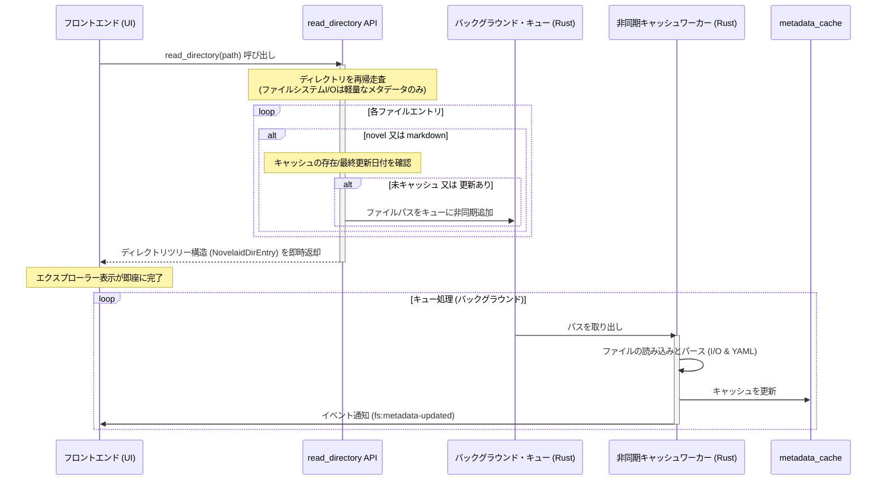

# novelaid-fs 仕様

## 1. 概要
`novelaid-fs` は、小説執筆用エディターである `novelaid-editor` (Electron版) および `novelaid-editor-next` (Tauri版) において、ローカルファイルシステムの操作、ドキュメント/フォルダのタイプ判定、およびメタデータ（フロントマター）の管理を抽象化して提供する専用のファイルシステムモジュールおよび仕様です。

新旧エディタで以下のように実装が分かれています。
- **現行（novelaid-editor）**: Node.js (`fs/promises`) および TypeScript をベースにした `src/novelaid-fs` ライブラリ。
- **次世代（novelaid-editor-next）**: Rust によるネイティブ Tauri プラグイン `tauri-plugin-novelaid-fs` と、フロントエンド向けのゲスト API (`guest-js`)。

---

## 2. ドキュメント・フォルダの種類（NovelaidDocumentType）
エディタ上でファイルを適切に分類・表示するために、以下のドキュメント種別が定義されています。

| 種別 (`NovelaidDocumentType`) | 概要 | 主な拡張子 |
| :--- | :--- | :--- |
| `novel` | 小説本文用のドキュメント | `.txt` |
| `markdown` | プロット、キャラクター設定、世界観資料など | `.md`, `.markdown` |
| `image` | キャラクターイラスト、地図などの画像資料 | `.png`, `.jpg`, `.jpeg`, `.gif`, `.webp`, `.svg`, `.bmp`, `.tiff`, `.ico` |
| `chat` | キャラクター同士の会話劇やインタビュー形式のテキスト | `.ch`, `.chat` |
| `css` | カスタムプレビュー等のスタイル定義ファイル | `.css` |
| `gitDiff` | Gitの変更履歴（差分）表示用の特殊タイプ | - |
| `browser` | 外部Webページブラウズ用の特殊タイプ | - |
| `external` | エディタ外の外部ファイル用タイプ | - |
| `unknown` | 上記に当てはまらない不明な形式 | - |

---

## 3. ドキュメント・フォルダタイプの判定ルール

### 3.1. ドキュメントの判定
ファイルパスから該当ファイルのドキュメントタイプを決定します。

1. **拡張子による基本判定** (共通)
   - `.txt` → `novel`
   - `.md`, `.markdown` → `markdown`
   - `.png`, `.jpg` 等の画像拡張子 → `image`
   - `.ch` / `.chat` → `chat`
   - `.css` → `css`
   - その他 → `unknown`

2. **`.novelaidattributes` によるカスタマイズ判定 (現行 `novelaid-editor` のみ実装)**
   - マークダウンファイルなどであっても、親ディレクトリに `.novelaidattributes` ファイルが存在し、そこにファイル名パターンとタイプのマッピングが定義されている場合は、そのタイプを最優先で適用します。

### 3.2. ディレクトリの判定
新規ファイル作成時のデフォルト形式の決定や、ツリー表示での分類のために、ディレクトリ自体にも推奨ドキュメントタイプを割り当てます。

1. **フォルダ名に含まれるキーワード判定** (共通)
   - `小説`, `novel` を含む場合 → `novel`
   - `設定`, `プロット`, `資料`, `wiki`, `markdown` を含む場合 → `markdown`
   - `画像`, `image` を含む場合 → `image`
   - `チャット`, `chat`, `channel`, `チャンネル` を含む場合 → `chat`

2. **`.novelaidattributes` による判定 (現行 `novelaid-editor` のみ実装)**
   - ディレクトリ内の `.novelaidattributes` に `./` の設定があればそれを適用。
   - または、親ディレクトリの `.novelaidattributes` に当該ディレクトリ名に対するマッピング（例: `dirName/`）があればそれを適用。

3. **継承ルール** (共通)
   - フォルダ名から判定できない場合は、親フォルダのドキュメントタイプを再帰的に引き継ぎます。
   - ルートディレクトリまたは親フォルダからも判定できない場合のデフォルトは `novel` となります。

### 3.3. ディレクトリスキャン時の除外ルール
エクスプローラーでの一覧取得（`read_directory`）や、プロジェクトスキャン（`scan_project_metadata`）の処理において、不要なシステムフォルダを処理対象から外すための除外ルールを適用します。

1. **ドットで始まるフォルダの除外**:
   - フォルダ名が `.` (ドット) で始まるフォルダ（例: `.git`, `.novelaid`, `.vscode` など）は、読み込みおよびスキャンの対象から一律**除外**します。
2. **ドットで始まるファイルの扱い**:
   - 一方で、ファイル名が `.` (ドット) で始まるファイル（例: `.novelaidattributes`, `.gitignore` など）については、現状**除外対象とはしません**。
   - 特に `.novelaidattributes` などのファイルは、ドキュメント属性の判定などに使用されるため、スキャンや表示の対象に含めます。

---

## 4. フロントマター（メタデータ）の処理仕様
小説や設定などのテキストドキュメント（`novel`, `markdown`）は、ファイル先頭に YAML 形式のメタデータ（フロントマター）を埋め込むことができます。

### 4.1. フロントマターのフォーマット
ファイルの先頭が `---` (ハイフン3つ) で開始されている場合、それをフロントマターとして認識します。
```markdown
---
title: "第一話 旅立ち"
status: "draft"
wordCount: 3450
---
ここから本文が始まります...
```

### 4.2. 読み込み時の処理 (`read_document`)
1. ファイル内容を文字列として取得し、先頭の `---` で囲まれたブロックを抽出。
2. YAML パーサーを使い、フロントマター部分をパースして `metadata` (JSONオブジェクト) に変換。
3. `---` ブロック以降の文字列を `content` (本文) とする。
4. フロントマターが存在しない、またはパースエラーとなった場合は、空のメタデータ `{}` を設定し、ファイル内容全体を `content` とします。

### 4.3. 書き込み時の処理 (`write_document`)
1. 保存対象の `metadata` が空でない場合、YAML シリアライズを行ってフロントマターを生成。
2. 本文 (`content`) の先頭にフロントマターを結合してファイルに書き込みます。
   ```text
   ---\n[YAML文字列]---\n[本文]
   ```
3. メタデータが空の場合は本文のみを書き込みます。

---

## 5. メタデータキャッシュとプロジェクトスキャン
長文の執筆プロジェクトでは、多数のファイルに含まれるステータスや文字数、タグなどのメタデータを高速に一覧表示および検索する必要があります。このため `novelaid-fs` はメタデータのメモリ内キャッシュ（インデックス）機構およびクエリ仕様を提供します。

### 5.1. メモリ内キャッシュ（`metadata_cache`）の構造
キャッシュは以下の構造を持つマップとしてメモリ内で保持されます。
- **キー**: 正規化されたファイルパス（Windows環境でも `/` に統一）。
- **値**: フロントマターから抽出されたJSONオブジェクト（`Record<string, any>`）。
  * 代表的なメタデータフィールドの例：
    * `title` (string): ドキュメントの表示名。
    * `status` (string): 執筆状態（`draft`（下書き）, `progress`（執筆中）, `completed`（完了） など）。
    * `tags` / `tag` (string | string[]): ドキュメントに付与された分類タグ（キャラクター名や世界観分類など）。
    * `chat` (object): 会話劇（チャット）形式の設定（`enabled: true` など）。
    * `id` (string): キャラクターや設定の固有ID。

### 5.2. プロジェクトスキャンとキャッシュのライフサイクル
1. **一括スキャン (`scan_project_metadata`)**:
   プロジェクトディレクトリの切り替え時（または起動時）に、ディレクトリ配下を巡回し、`novel`（`.txt`）および `markdown`（`.md`）ファイルを順次読み込み、フロントマターが存在すればそれを抽出してキャッシュを再構築します。
2. **オンデマンド更新**:
   ドキュメントの読み込み (`read_document`) または書き込み (`write_document`) が実行された際、該当パスのキャッシュを自動的に更新します。
3. **削除・移動時の連動**:
   ファイル削除やファイル監視イベント（`unlink`）を検知した際、キャッシュから該当パスのエントリを削除します。

### 5.3. 無視リスト（`.novelaidignore`）によるフィルタリング
不要なファイルやシステム関連のファイルをスキャン対象外とするため、プロジェクトルート直下に配置された `.novelaidignore` ファイルに基づいてスキャンを制御します。
- `node_modules` やドットで始まるフォルダ（`.git` 等）に加えて、`.novelaidignore` に指定されたワイルドカードパターン（例: `archive/*`, `temp.md`）に合致するパスは、スキャンおよびキャッシュ更新 of 対象外（無視）とします。

### 5.4. メタデータのクエリおよび検索仕様
フロントエンドの機能（キャラクター設定の参照や、タグによる資料一覧の表示など）のため、キャッシュ（インデックス）を用いた以下の高速なクエリ機能を提供します。

1. **タグ検索 (`query_by_tag`)**:
   - 引数: `tag` (単一または配列)
   - 挙動: キャッシュ内の `tags` または `tag` フィールドの値が一致するファイルを検索し、該当するドキュメントのパス、名称、およびメタデータのリストを返します。
2. **チャット機能有効ファイルの検索 (`query_chat_enabled`)**:
   - 挙動: キャッシュ内で `chat.enabled === true` となっているドキュメント（主に会話劇設定ファイル）を検索し、そのリストを返します。
3. **IDによる特定キャラクター検索 (`find_character_by_id`)**:
   - 引数: `id` (ID、名前、またはファイル名)
   - 挙動: メタデータ内の `id` フィールド、`name` フィールド、あるいはファイル名（拡張子除く）のいずれかが指定された `id` と一致する設定ドキュメントを検索し、単一のエントリを返します。

### 5.5. 非同期キューを用いたディレクトリスキャンとキャッシュ更新の統合仕様
現状の設計では、ディレクトリツリーを構築する「ディレクトリスキャン (`read_directory`)」と、メタデータ（フロントマター）を全ファイルから読み込んで抽出する「プロジェクトメタデータスキャン (`scan_project_metadata`)」が、それぞれ独立した再帰的走査ロジックを持っています。

これらを単に同期処理として1つに統合した場合、ディレクトリスキャンを実行した際に対象の全テキストファイルのI/O読み込みとパース処理が同時に走るため、ディレクトリ構成を表示するだけの用途においてUIの応答性が極めて悪化します。

このパフォーマンス問題を解消しつつコードの走査ロジックを一本化するため、以下の**「非同期キュー方式」**を導入します。

#### 5.5.1. アーキテクチャと処理フロー


#### 5.5.2. 技術的要件
1. **ディレクトリスキャンの軽量化**:
   - `read_directory` 自体は、ファイルの本文（内容）を読み込まず、ファイル名、パス、ファイルサイズ、最終更新日時（mtime）などのシステムメタデータのみを高速に取得してツリーを構成し、即座に呼び出し元へ戻します。
2. **メタデータ抽出の非同期キューイング**:
   - `read_directory` 走査中に `novel` または `markdown` に該当するファイルを発見した際、以下の条件に該当する場合はそのファイルパスを非同期タスクキュー（Rust の `tokio::sync::mpsc` やスレッドプール等を利用）に投入します。
     * メモリ内の `metadata_cache` にまだ該当パスのキャッシュが存在しない。
     * ファイルシステムの `mtime`（最終更新時刻）が、キャッシュ内に記録されている時刻より新しい。
   - すでにキャッシュが最新の状態で存在する場合はキューイングをスキップし、不要なI/Oやパース処理を回避します。
3. **バックグラウンドワーカーの実行**:
   - キューの実行は、Tauriの非同期ランタイム（Tokio）上の別スレッドで直列（または限定された並列数）で動作するワーカーが処理します。
   - ワーカーはキューから取得したパスのファイルを読み込み、フロントマターを抽出・解析して `metadata_cache` に書き込みます。
4. **イベントによるフロントエンド同期**:
   - バックグラウンドでキャッシュが書き換えられた際、必要に応じてフロントエンドへ `fs:metadata-updated` イベントを発行し、文字数カウントやタグ情報などの動的なUI表示を遅延してリアクティブに更新できるようにします。

#### 5.5.3. スキャン進捗状況の通知仕様
スキャン全体の処理状況を可視化するため、バックグラウンドでのキュー処理中に以下の仕組みで進捗をフロントエンドに通知します。

1. **カウンタ管理**:
   - `total_jobs` (アトミックカウンタ): `read_directory` 内の再帰走査でキューへ送信するたびにインクリメントします。
   - `processed_jobs` (アトミックカウンタ): 非同期ワーカーが1件処理を完了するごとにインクリメントします。
2. **通知イベント (`fs:metadata-scan-progress`)**:
   - ワーカーが処理を1件終えるごとに、Tauri のイベントを通じて進捗状況をブロードキャストします。
   - **ペイロード構造 (`ScanProgressPayload`)**:
     * `processed` (u32): 処理が完了したファイル数。
     * `total` (u32): キューに投入された総ファイル数。
     * `currentFile` (string): 現在（または直近に）処理を完了したファイルの名称。
3. **完了時のクリーンアップ**:
   - `processed_jobs` が `total_jobs` に達した（すべてのスキャンが完了した）時点で、アトミックカウンタは自動的に `0` にリセットされます。

---

## 6. 新旧エディタにおける実装の差異と移植上の注意点
`novelaid-editor-next` (Tauri版) への移行にあたり、Rust 側プラグイン `tauri-plugin-novelaid-fs` の実装においていくつか注意点があります。

1. **`.novelaidattributes` の未実装**
   現行の Rust プラグイン実装では、`.novelaidattributes` を利用した柔軟なドキュメント・ディレクトリタイプ判定ロジックが省略されています。拡張子とフォルダ名のキーワード判定のみとなっているため、将来的に旧エディタと同等の柔軟性を持たせるには、Rust 側での `.novelaidattributes` 解析ロジックの実装が必要です。
2. **`.novelaidignore` による無視処理の未実装**
   旧エディタでは `.novelaidignore` を読み込んで不要なファイルのスキャンをスキップする処理がありましたが、現在の Rust 側プラグインのディレクトリスキャンおよび非同期キュー登録時には、`.novelaidignore` による無視ファイルの判定ロジックが実装されていません。
3. **メタデータクエリ API の未実装**
   旧エディタでは、タグ検索 (`queryByTag`) やキャラクターID検索 (`findCharacterById`) などのクエリロジックをメインプロセスの `MetadataService` で処理していましたが、Tauri版では現在キャッシュ全体を返す `get_metadata_cache` しか実装されていません。これらのクエリをフロントエンド側（TypeScript）で行うか、Rust 側に移植するかを検討する必要があります。
4. **バイナリファイルの読み込み制限**
   Rust 側の `read_document` は `std::fs::read_to_string` を使用しているため、画像などのバイナリファイルを誤って読み込もうとすると無効なUTF-8エラーとなります。画像やその他の非テキスト形式のファイルに関しては、フロントエンド側で直接パスを扱うか、Tauri のアセット読み込み機能を使用する必要があります。
5. **パスの正規化**
   旧エディタでは Windows と POSIX の差異を埋めるためにパス中のバックスラッシュ (`\`) をスラッシュ (`/`) に置換して正規化していました。Tauri 版でもファイルパスの受け渡しにおいて OS 固有のパス区切り文字への対応や、スラッシュ統一の挙動に注意する必要があります。
